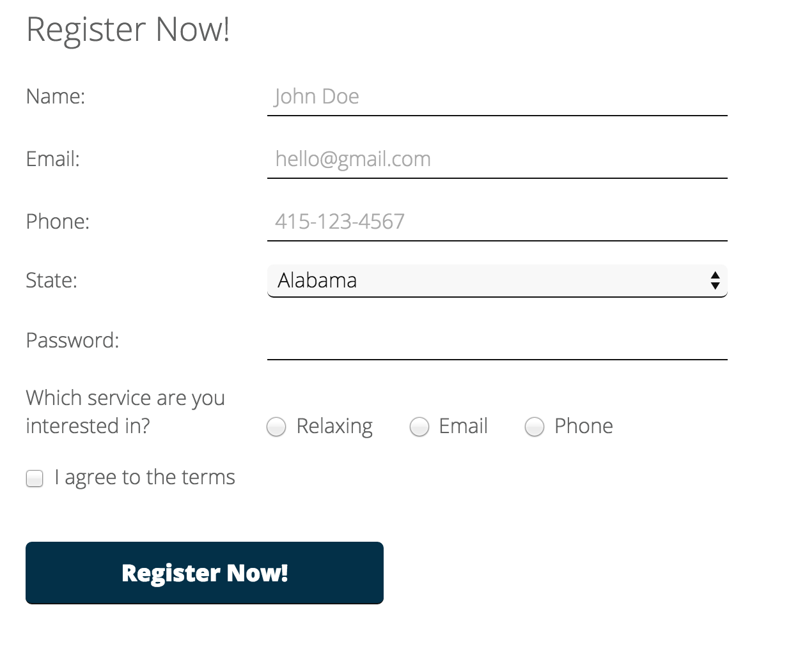
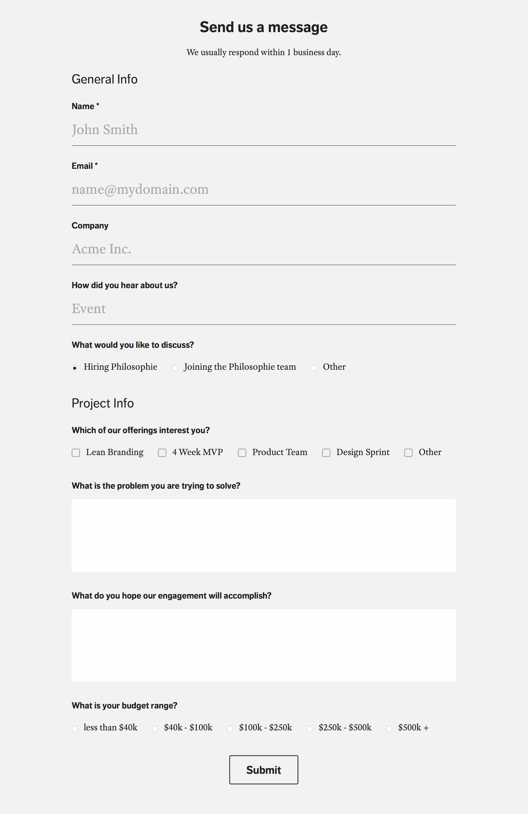
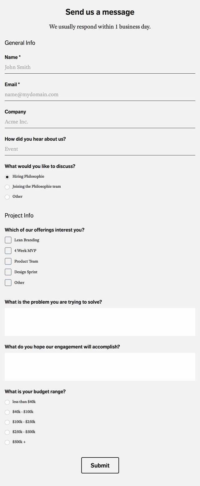

#FEWD Week #8: Forms

---


###Description 

This week, you'll be practicing your form skills: you have the option of adding a form to your final project or adding a registration form to the Relaxr site. The form you build must include at least three different types of HTML form elements and some light CSS styling.

Starter code for the Relaxr registration form is in the assignment folder along with a sample design image. Feel free to get creative with the styling. You should update the 'Get it Now' buttons on the index & blog pages to link to your new registration page.

If you choose instead to add a form to your final project please let the instructors know via Slack.

---



<br>

---


###Real-World Applications

- Be able to apply the proper HTML and CSS styles to create a modern web form
- Revisit applications and projects to iterate on code you've written 

<br>

---

###Technical Requirements 

- Use at least three different types of HTML5 form elements: ```input```, ```textarea```, ```select```, ```radio``` ```button```, ```dropdown```, ```checkbox```
- Style forms lightly using CSS

Examples:

* Sign-up forms
    * Ensure user's password is not visible when they are entering it
    * Provide automatic email validation with email fields
* Feedback forms
    * Textarea controls for multi-line text.
    * select controls for feedback categories
* Surveys
    * Checkboxes and radio buttons for survey options

####Bonus

- Use responsive media queries to allow for proper rendering on mobile devices 
- Use jQuery and display an error message if any of the input fields are left blank upon submission 
- To replicate application flow, add another page that says "Thanks for Relaxing with us!" after submission

<br>

---

###Resources

- [W3Schools: Form Elements](http://www.w3schools.com/html/html_form_elements.asp)
- [W3Schools: Input Types](http://www.w3schools.com/html/html_form_input_types.asp)
- [MDN: Styling HTML Forms](https://developer.mozilla.org/en-US/docs/Web/Guide/HTML/Forms/Styling_HTML_forms)
- [Webdesign.com: Form Validation with CSS3/HTML5](http://webdesign.tutsplus.com/tutorials/bring-your-forms-up-to-date-with-css3-and-html5-validation--webdesign-4738)
- [CSS-Tricks.com: Tips for Creating Great Web Forms](http://css-tricks.com/tips-for-creating-great-web-forms/)
- [jQuery API Docs: .val( ) function](http://api.jquery.com/val/)

Example forms




<br>

---

###Evaluation / Submission


When ready for evaluation, students should push their code to the appropriate repository. 


###Final Project Milestone 3

By week 8, you should have a draft of the JavaScript and jQuery you'll need for your final project.  For this week, focus iterating on your project to turn in an updated draft and add form elements if necessary. 